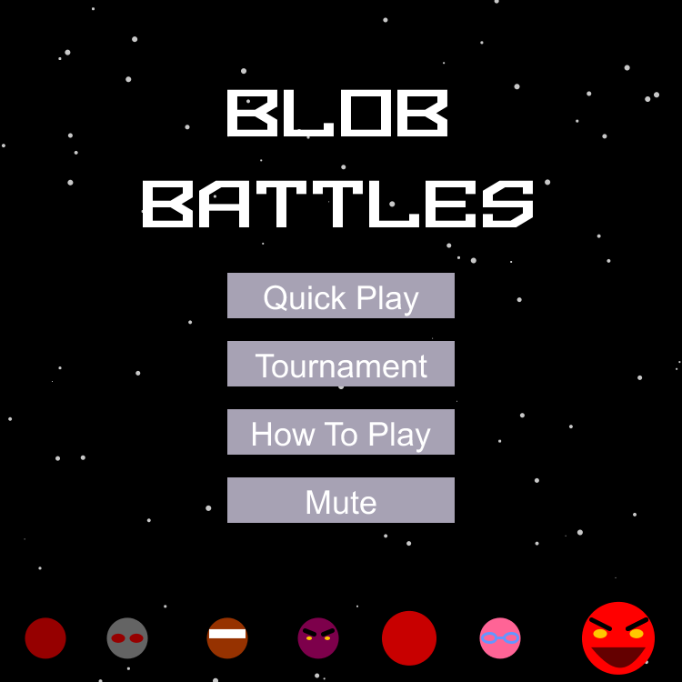
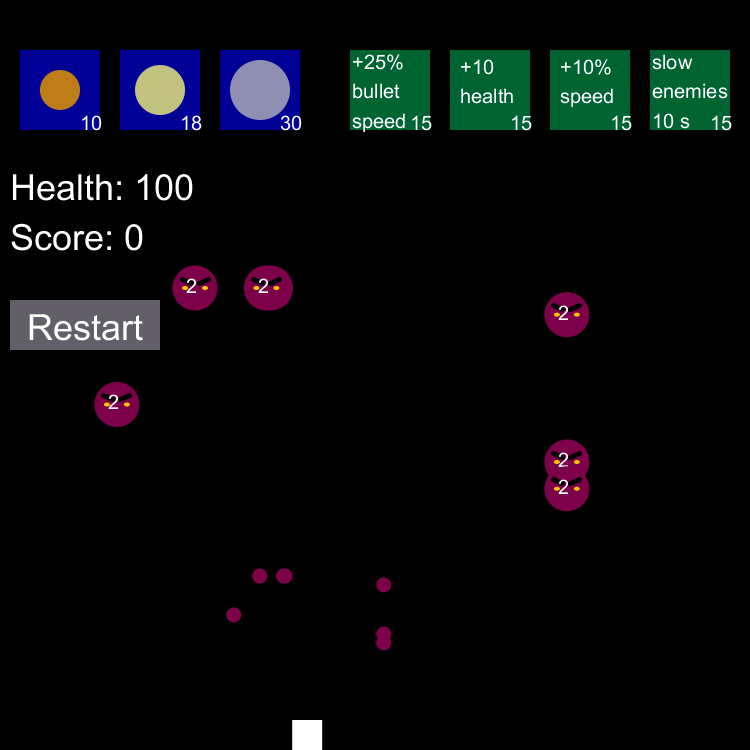
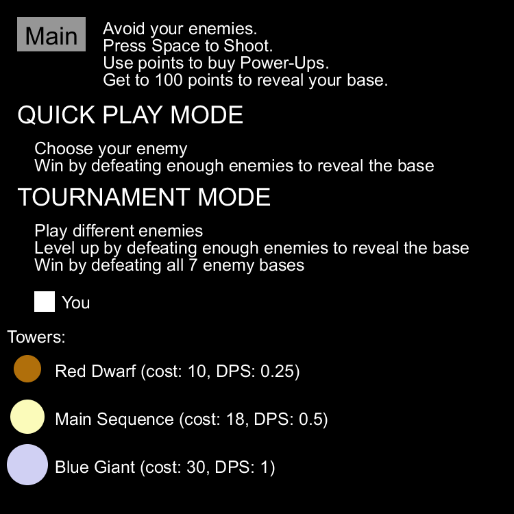
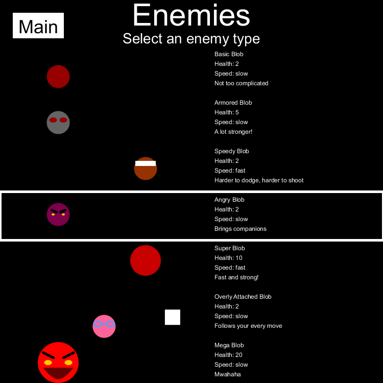

## Description
This project was created in a team of four people including myself.
This game portrays a good square fighting for its life in space against the dark forces of circles. There will be various enemies that the good square may choose to fight to ultimately be victorious at the end. 

Rules:
1.Dodge enemies to avoid losing health.
2.Defeat enemies to gain points. Accomplish this by using the spacebar to shoot. 
3.Points can be spent to buy the following booster packs or towers that help shoot the enemies
	a.3 towers that cost 10, 20, 30 points respectively. Bigger and more powerful 
	towers cost more points
	b.Faster bullet speed for 15 points
	c.Restore health for 15 points
	d.Faster firing rate for 15 points
	e.Slow down enemies for 10 seconds for 15 points
3. Reach >= 100 points to reveal the base.
4. Reach the base to win.

#### Personal Contribution
I created the Bullet, Shoot, Button, and collaborated on the New Game class. I also applied the enemy stats to the enemy class. Using the existing enemy info class of a teammate, I created the tournament mode.

#### Main Menu                      

#### Sample Game Play

#### How to Play                    
      

#### Enemy Types

## Requirements
- Processing

## How to Use
Open the file named "blob_battles_game.pde." Click play. The player must move using the arrow buttons on the keyboard. The player shoots using the spacebar. The player wins once they have reached a score of 100 and they go to their base. However, the player can continue to play to increase their score and then go to the base to reveal the win screen.
